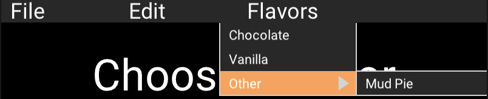

# Scenic widget contrib

This repo is intended as a "melting-pot" for experimental widgets, used by
Scenic applications - kind of like a communal workbench. If you are
developing a Scenic app, clone this repo and include it as a local dependency,
then as you develop new components, start putting them inside this library -
not only will developing your Scenic components this way mean they are
nicely de-coupled from your application logic, it makes them easier to
share & be improved upon by the broader community.

Licensed as [Apache 2.0](./LICENSE)

## Getting Started

Add `{:scenic_widget_contrib, github: "scenic-contrib/scenic-widget-contrib"}`
to your deps in mix.exs

## Components

### MenuBar

- [MenuBar](./lib/components/menu_bar/)
- Status: Polished

A nested menu at the top of the screen:

### FrameBox

- [FrameBox](./lib/components/frame_box/)
- Status: For Debugging

### TestPattern

- [TestPattern](./lib/components/test_pattern/)
- Status: In Development

## Getting Involved

See [CONTRIBUTING.md](./CONTRIBUTING.md) for info on contributing your own
widgets and see [DEVELOPMENT.md](./DEVELOPMENT.md) for info on developing your
own widgets.
